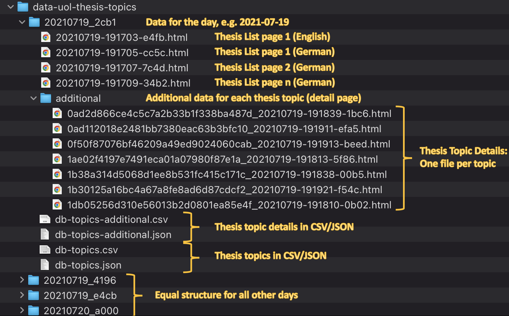
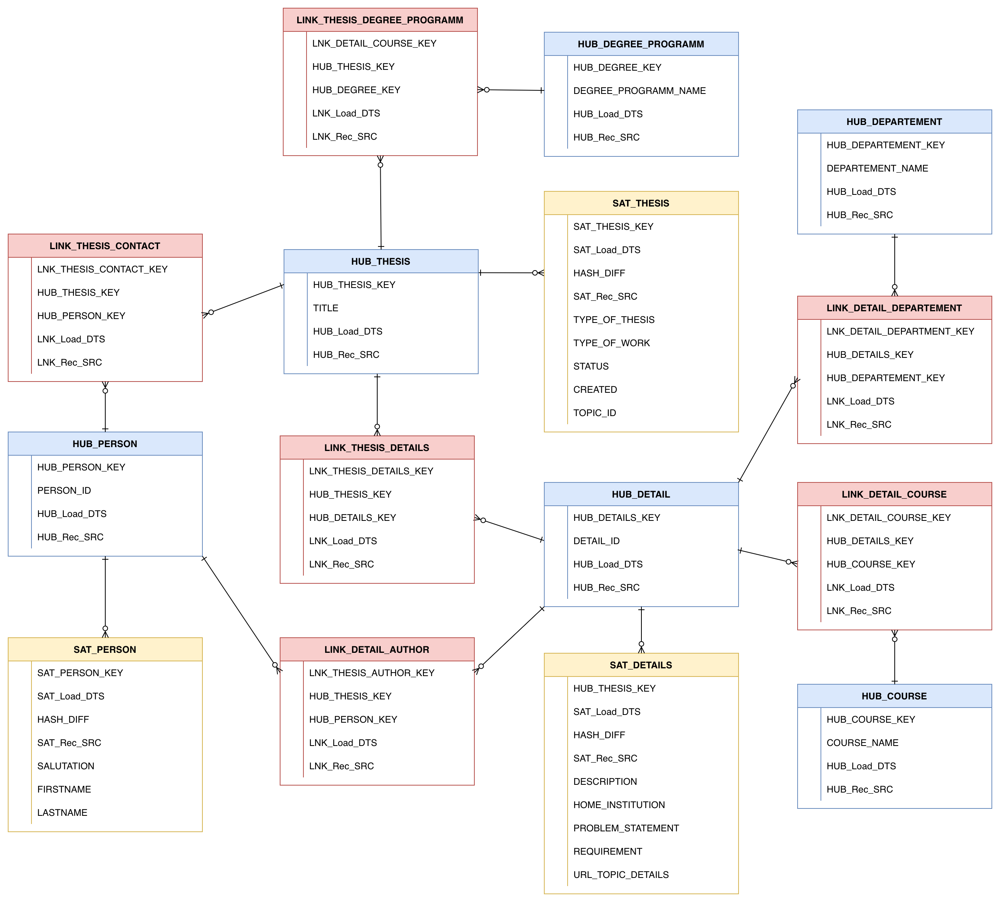

# BI Mini-Project P02

## Introduction
BI Mini Project that was developed at the University of Oldenburg. The project is based on a dataset of thesis topics offered at the university.

This document is a detailed technical report about implementation. For setting up the project see _SETUP.md_.

## Milestones of the project
The main goal of the project is to answer specific business questions and determine KPIs based on
the data given in the dataset.

The project is divided in 5 major milestones which are described in detail in this document.
* Step 1: Review of the Data Set
* Step 2: Data Vault Model
* Step 3: Database Schema and Database
* Step 4: ETL-Process
* Step 5: Visualization and KPIs (Project Tasks)

## Step 1: Review of the Data Set
The dataset includes daily HTML-Export of all thesis topics with additional data (thesis topic details). There is also a CSV and JSON Representation of the thesis topics and thesis topic details in the dataset.
As the data is exported from the Stud.IP-Thesis Plugin which implements a pagination, there are multiple HTML-Exports per day. Also every detail page (when following the link on the thesis list) is present in the data set via a single HTML-Export.

The image describes the structure of the data set (number of files in /additional reduced for image):

`Note: The HTML-Export in the data set only contains the first three pages and the last page of the thesis topic list. This unintentionally missing data is considered by best effort but may result in inconsistent results later on!`

The first step is to analyze the given data and data fields across the files in the data set.
Analyzing the HTML Exports and CSV/JSON-files yields to a list of all available data fields, with some internal fields only given in the CSV/JSON-files like the "topic_id".
After that semantically equivalent (same content) data fields in the thesis topic list and thesis topic details are considered. By a randomized sample of 30 thesis topic details the equality of data fields was investigated. This yields to following fields that are assumed to contain the same data (left side of equal sign referring topics list, right side the topic details):
* "Title"
* "Type of thesis"
* "Type of work"
* "Degree programmes" = "Study data: Degree programmes"
* "Contact Person" = "Study data: Contact person"
* "Status"
* "Created"

Furthermore, the different files in the data set contain different data fields. For example the "Study data: Departements"-Field of the HTML-Export is missing in the CSV/JSON Files. Also, the field names change between German and English, so they must be translated to English. Considering the equivalent data fields and showing the possible origins of the data fields for the ETL process yields the following table:

| Thesis Topic List Fields | Thesis Topic Detail Fields    | Possible Origins for extraction                       |
|--------------------------|-------------------------------|-------------------------------------------------------|
| Title                    | Title                         | List + Detail HTML-Export, **db-topics.json+csv**     |
| Type of thesis           | Type of thesis                | List + Detail HTML-Export, **db-topics.json+csv**     |
| Degree programmes        | Study data: Degree programmes | List + Detail HTML-Export, **db-topics.json+csv**     |  
| Type of work             | Type of work                  | List + Detail HTML-Export, **db-topics.json+csv**     |  
| Contact person           | Study data: Contact person    | List + Detail HTML-Export, **db-topics.json+csv**     |  
| Status                   | Status                        | List + Detail HTML-Export, **db-topics.json+csv**     |  
| Created                  | Created                       | List + Detail HTML-Export, **db-topics.json+csv**     |  
|                          | Author                        | Detail HTML-Export, **db-topics-additional.json+csv** |
|                          | Description                   | Detail HTML-Export, **db-topics-additional.json+csv** |
|                          | Home institution              | Detail HTML-Export, **db-topics-additional.json+csv** |
|                          | Problem statement             | Detail HTML-Export, **db-topics-additional.json+csv** |
|                          | Requirement                   | Detail HTML-Export, **db-topics-additional.json+csv** |
|                          | Study data: Departements      | **Detail HTML-Export**                                |
|                          | Study data: Assigned courses  | **Detail HTML-Export**                                |
|                          | topic_id                      | **db-topics.json+csv**, db-topics-additional.json+csv |
|                          | url_topic_details             | **db-topics.json+csv**                                |

For reference of column "Possible Origins", see the folder structure image in this section. The marked (bold) origins show the preferred file for accessing this information later on in the ETL process. A file is **preferred** when it is the only file where this data field is available or when it is already structured convenient (JSON, XML) for extraction. As the "Study Data: Departement" and "Study data: Assigned courses" data fields are only present in the Detail HTML-Export, the HTML must be parsed/transformed when extracting the data.
The table concludes this step of the project.

## Step 2: Data Vault Model
The Data Vault Model is a modern database modeling method and is created with the results of the analysis and data understanding from Step 1.

As a first step the Object Types of the data set are considered. The review lead to following Object Types (Conceptual Data Model):
* Thesis
* Detail
* Person
* Degree programm
* Departement
* Course

With these Object Types the Data Vault Model (2.0) can be created.

The following image shows the Data Vault Model:

The following decisions or assumptions were made while creating the Data Vault Model (based on the tutorial source: https://www.vertabelo.com/blog/data-vault-series-data-vault-2-0-modeling-basics/):
* The Hub Thesis and Hub Details represent the views from the Stud.IP Thesis Topic List and Thesis Topic Detail.
* A Person is represented by a Hub that is linked to the Hub Thesis (for contact persons) and to the Hub Detail (for authorship).
* The Hub Person uses a PERSON_ID as a business key because there may be persons with exactly the same name.
* The title of a thesis (see Hub Thesis) is assumed to be unique.
* As there is no business key for the Hub Details, the same value as in the TOPIC_ID is used (it is the ID of the thesis).
* Some Hubs missing Satelites because no additional descriptive columns are in the dataset. This may change in the future so it is possible to add new Satelites later on.
* The inclusion of the business keys of parent Hubs in the Link is not yet used (Data Vault 2.0 feature).

Based on the Data Vault Model the next step is the creation of the Database Schema.

## Step 3: Database Schema and Database
The next step is to define the Database Schema and to install and configure the PostgreSQL Database.

First, the Database Schema is derived from the Data Vault Model in Step 2. It already contains the needed data types as well as the relations between Hubs, Links and Satellites (the tables). So there is already logical information about the data. 
The Database Schema is created via the Data Definition Language SQL. As this project uses PostgreSQL as DBMS, the SQL Dialect for PostgreSQL must be considered. 

The resulting SQL script for the creation of the schema is placed under *infrastructure/database*. As a first step, only the Primary Keys (PK) were added as constraints.
Furthermore, the SQL script contains the creation of the thesis database with a user and permission, as 
well as the database creation for the Metabase application (see Step 5).

For automation purposes, the PostgreSQL Database is created and configured by Docker via 
Docker Compose (see _infrastructure/docker-compose.yml_).

## Step 4: ETL-Process
After understanding the data and setting up the database with the database schema the ETL-Process can be started.
The dataset contains about 2.2GB of raw data that is assumed to contain a lot of duplicated data due to the daily export of the thesis topic list and thesis topic details. The data fields for single thesis do not change so frequently. Several files contain the same data fields (see Table in Step 1) and the HTML files contain a lot of HTML-Elements etc. that are not relevant for the project (e.g. Stud.IP menu bar).

Before starting the ETL-Process, cleanup of the data set/ data set structure may be reasonable. Further information and necessary cleaning is described in the _SETUP.md_ (_Preparing the Data Set_).

To extract and transform the data from the original data set into a "consolidated" data set a Python script is used. 
For working with the data the _Pandas Framework_ was used, as it provides convenient functionalities (e.g. Dataframes) 
for ETL processes. The script does the following steps for _each_ export folder in the dataset:

* Extract all relevant data fields from the different files into memory
  * Extract data fields from db-topics.csv
  * Extract data fields from db-topics-additional.csv
  * Extract data fields from Thesis Details HTML-Export (complex HTML-Parsing)
* Transform the extracted data fields as needed
* Merge the data fields from the different files
* Import the data into the database by SQL insert statements

For the extraction of data from the HTML-Exports complex functions were needed, whereas the CSV files were read into 
memory by Dataframes (_Pandas_). For the connection and import into the Database the Framework _psycopg2_ was used.

For further information see the commented source code under *etl/consolidate.py*. 

In order to execute the ETL process (Python Script) the development environment must be configured. This is described 
in the SETUP.md (Creating Python Environment).

## Step 5: Visualization and KPIs (Project Tasks)