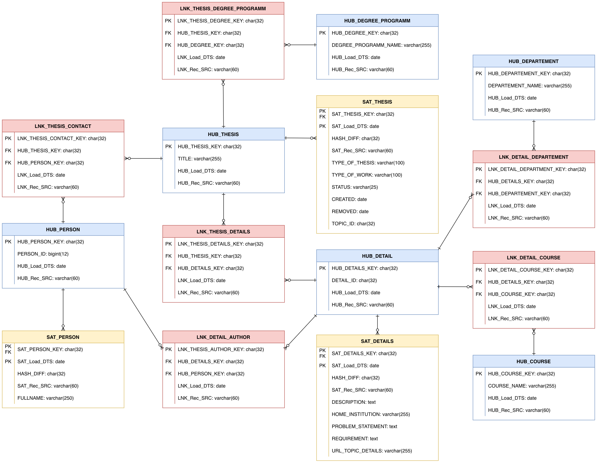

# BI Mini-Project P02

## Introduction
BI Mini Project that was developed at the University of Oldenburg. The project is based on a dataset of thesis topics 
offered at the university in Stud.IP.

This document is a detailed technical report about implementation. For setting up the project see _SETUP.md_.

## Milestones of the project
The main goal of the project is to answer specific business questions and determine KPIs based on
the data given in the dataset.
The business questions and mandatory KPIs are listed in a separate task document (_P02 - Task for BI mini-project_).

The process model (steps) of this project is based on classic Business Intelligence projects. Therefore it is divided in 
5 major milestones which are described in detail in this document:
* _Step 1_: Review of the Data Set (Data Understanding)
* _Step 2_: Data Vault Model
* _Step 3_: Database Schema and Database
* _Step 4_: ETL-Process
* _Step 5_: Visualization and KPIs (Project Tasks)

## Step 1: Review of the Data Set (Data Understanding)
The dataset includes daily HTML-Exports of all thesis topics with additional data (thesis topic details). There is also a 
CSV and JSON representation of the thesis topics list and thesis topic details in the dataset. As the data is exported from 
the Stud.IP-Thesis Plugin which implements a pagination, there are multiple HTML-Exports per day. Also every detail 
page (when following the link on the thesis list) is present in the data set via a single HTML-Export.

This figure shows the structure of the data set (number of files in /additional reduced for illustration):


**Note: The HTML-Export in the data set only contains the first three pages and the last page of the thesis topic list. 
This unintentionally missing data is considered by best effort (see Step 4: ETL) but may result in inconsistent results 
later on!**

The first and second HTML-Export file contain the same thesis data and only differ in language (see Table Header). 
As only the first page is exported in English, the German data field values are used for the following steps. The names 
of the data fields (columns) itself will be in English language to be consistent in the ETL process and avoid naming 
issues.

The first step is to analyze the given data and data fields across the files in the data set. Analyzing the HTML Exports 
and CSV/JSON-files yields to a list of all available data fields, with some internal fields only given in the CSV/JSON-files 
like the "topic_id". After that semantically equivalent (same content) data fields in the thesis topic list and thesis 
topic details are considered. By a randomized sample of 30 thesis topic details the equality of data fields is investigated. 
This yields to following fields that are assumed to contain the same data (left side of equal sign referring topics 
list, right side the topic details):
* "Title"
* "Type of thesis"
* "Type of work"
* "Degree programmes" = "Study data: Degree programmes"
* "Contact Person" = "Study data: Contact person"
* "Status"
* "Created"

Furthermore, the different files in the data set contain different data fields. For example the "Study data: Departements"-Field 
of the HTML-Export is missing in the CSV/JSON Files. Also, the field names change between German and English, so they 
must be translated to English. Considering the equivalent data fields and showing the possible origins of the data 
fields for the ETL process yields the following table:

| Thesis Topic List Fields | Thesis Topic Detail Fields    | Possible Origins for extraction                       |
|--------------------------|-------------------------------|-------------------------------------------------------|
| Title                    | Title                         | List + Detail HTML-Export, **db-topics.json+csv**     |
| Type of thesis           | Type of thesis                | List + Detail HTML-Export, **db-topics.json+csv**     |
| Degree programmes        | Study data: Degree programmes | List + Detail HTML-Export, **db-topics.json+csv**     |  
| Type of work             | Type of work                  | List + Detail HTML-Export, **db-topics.json+csv**     |  
| Contact person           | Study data: Contact person    | List + Detail HTML-Export, **db-topics.json+csv**     |  
| Status                   | Status                        | List + Detail HTML-Export, **db-topics.json+csv**     |  
| Created                  | Created                       | List + Detail HTML-Export, **db-topics.json+csv**     |  
|                          | Author                        | Detail HTML-Export, **db-topics-additional.json+csv** |
|                          | Description                   | Detail HTML-Export, **db-topics-additional.json+csv** |
|                          | Home institution              | Detail HTML-Export, **db-topics-additional.json+csv** |
|                          | Problem statement             | Detail HTML-Export, **db-topics-additional.json+csv** |
|                          | Requirement                   | Detail HTML-Export, **db-topics-additional.json+csv** |
|                          | Study data: Departements      | **Detail HTML-Export**                                |
|                          | Study data: Assigned courses  | **Detail HTML-Export**                                |
|                          | topic_id                      | **db-topics.json+csv**, db-topics-additional.json+csv |
|                          | url_topic_details             | **db-topics.json+csv**                                |

For reference of column "Possible Origins", see the folder structure figure in this section. The marked (bold) origins 
show the preferred file for accessing this information later on in the ETL process. A file is **preferred** when it is 
the only file where this data field is available or when it is already structured convenient (JSON, XML) for extraction. 
As the "Study Data: Departement" and "Study data: Assigned courses" data fields are only present in the Detail 
HTML-Export, the HTML must be parsed/transformed when extracting the data. The two data fields "kurzdarstellung_der_problematik" 
and "abgeschlossen_am" that are present in the newest daily thesis exports contain mostly empty values and are disregarded.

The table concludes this step of the project.

## Step 2: Data Vault Model
The Data Vault Model is a modern database modeling method and is based on the results of the analysis and data understanding from Step 1.

As a first step the Object Types of the data set are considered. The review lead to following Object Types (Conceptual Data Model):
* Thesis
* Detail
* Person
* Degree programm
* Departement
* Course

With these Object Types the Data Vault Model (2.0) can be created.

The following figure shows the Data Vault Model:


The following decisions or assumptions are made while creating the Data Vault Model 
(based on the tutorial source: https://www.vertabelo.com/blog/data-vault-series-data-vault-2-0-modeling-basics/):
* The Hub Thesis and Hub Details represent the views from the Stud.IP Thesis Topic List and Thesis Topic Detail.
* A Person is represented by a Hub that is linked to the Hub Thesis (for contact persons) and to the Hub Detail (for authorship).
* The Hub Person uses a PERSON_ID as a business key because there may be persons with exactly the same name.
* The title of a thesis (see Hub Thesis) is assumed to be unique.
* As there is no business key for the Hub Details, the same value as in the TOPIC_ID is used (it is the ID of the thesis).
* Some Hubs missing Satellites because no additional descriptive columns are in the dataset. This may change in the future, 
so it is possible to add new Satellites later on.
* The inclusion of the business keys of parent Hubs in the Link is not yet used (Data Vault 2.0 feature).

Based on the Data Vault Model the next step is the creation of the Database Schema.

## Step 3: Database Schema and Database
The next step is to define the Database Schema and to install and configure the PostgreSQL Database.

First, the Database Schema is derived from the Data Vault Model in Step 2. It already contains the needed data types as 
well as the relations between Hubs, Links and Satellites (the tables). So there is already logical information about the data. 
The Database Schema is created via the Data Definition Language SQL. As this project uses PostgreSQL as DBMS, the 
SQL Dialect for PostgreSQL must be considered. 

The SQL script for the Database Schema is created manually based on the Data Vault Model and is placed under 
*infrastructure/database*. As a first step, only the Primary Keys (PK) are defined as constraints. Furthermore, 
the SQL script contains the creation of the thesis database with a user and permission, as well as the database creation 
for the Metabase application (see Step 5).

The PostgreSQL Database is automatically created and configured by Docker via Docker Compose 
(see _infrastructure/docker-compose.yml_). The PostgreSQL Database Service is configured with a Docker volume in order to
persist the database and not loose data after restart.

## Step 4: ETL-Process
After understanding the data and setting up the database with the database schema the ETL-Process can be started.
The dataset contains about 2.2GB of raw data that is assumed to contain a lot of duplicated data due to the daily 
export of the thesis topic list and thesis topic details. The data fields for single thesis do not change so frequently. 
Several files contain the same data fields (see Table in Step 1) and the HTML files contain a lot of HTML-Elements etc. that 
are not relevant for the project (e.g. Stud.IP menu bar).

Before starting the ETL-Process, cleanup of the data set and its structure is mandatory. Further information and 
necessary cleaning is described in the _SETUP.md_ (_Preparing the Data Set_).

### Extract and Transform
To extract and transform the data from the original data set into a "consolidated" data set a Python script is used. 
For working with the data the _Pandas Framework_ is used, as it provides convenient functionalities (e.g. Dataframes) 
for ETL processes. The script does the following steps for each export folder in the dataset:

* Extract all relevant data fields from the different files into memory
  * Extract data fields from db-topics.csv
  * Extract data fields from db-topics-additional.csv
  * Extract data fields from Thesis Details HTML-Export (complex HTML-Parsing)
* Transform the extracted data fields as needed
* Merge the data fields from the different files
* Expand the merged data with relevant data fields
  * Export date of the thesis (export folder date)
  * Removed date of thesis
* Check if all data frames contain same number of rows

For illustration this figure shows the extract and transform of thesis data for one export folder:


For the extraction of data from the HTML-Exports Python functions are used, whereas the CSV files are read into 
memory by Dataframes (_Pandas_). The expansion of the merged data is necessary to answer the business questions and to 
comply with the Data Vault Model. The "export_date" of the imported thesis files is needed to track changes in the data. 
The export date is given directly by the export folder name.
The "removed" date shows when a thesis was removed/hidden and is no more offered. As there is missing data in the daily 
thesis exports (see Step 1, Note) and the removal date of thesis is not given, it is determined as follows:

* Define the overall latest export date in the data set
* Group the exported thesis and determine the latest export date of each thesis
* Compare the latest export date of each thesis with the overall latest export date
  * If the dates are equal, the thesis was present in the latest export and so it is not removed
  * If the dates are not equal, the thesis is no longer present in the latest export and the removal date is the last 
date the thesis was exported

The following figure shows the calculation of the removed date of the thesis:


After important and transforming all thesis data, the consistency of the merged Dataframe is checked by comparing 
the number of rows to all other Dataframes.

### Import
Next step of the ETL-Process is the import of the transformed thesis data in the database. For the database connection 
and imports the Framework _psycopg2_ is used. The connection to the database is established with the beforehand created 
thesis user. The import of thesis data is implemented by iterating row-wise over all thesis in the merged Dataframe. 
For every row (thesis), all data fields are extracted and used to create the _Insert_ statements. 

The _Insert_ statements are implemented considering the Data Vault Model with calculation of hash values for business 
keys and calculation of "hash_diff" on descriptive columns. In order to avoid duplicate database imports in Hubs, 
Satellites and Links a Set "cache" with already inserted md5 hash values is held. When a md5 hash value is already 
present in the Set "cache", no insert statement in the table is executed. The md5 hash calculation is done via two 
helper functions. The following code shows an example for a Link table, the variables are named similar to the Data 
Vault Model (_see Table lnk_detail_author_):
```python
detail_author_key = md5_columns(thesis_id, author_person_id)
if detail_author_key not in lnk_detail_author_cache:
  hub_details_key = md5(thesis_id)
  hub_person_key = md5(author_person_id)
  insert_into_db("INSERT INTO lnk_detail_author VALUES (%s, %s, %s, %s, %s);",
                 (detail_author_key, hub_details_key, hub_person_key, load_date, 'DigiDigger'))
  lnk_detail_author_cache.add(detail_author_key)
```

As a generated person id is needed for inserting the authors and contacts into the thesis database, an own id 
generator is used (see etl/id_generator.py). The generated person ids are stored in a dictionary accessible by the 
name of the author/ contact for later use in other _Import_ statements. As an alternative, a database sequence could be 
used but the database must be queried before every insert of new persons.

For further information and documentary of the ETL process see the commented source code under *etl/consolidate.py*. 
To track progress and outcome of the ETL-process, logging is implemented and a report of the progress is given when 
executing the Python script.

In order to execute the ETL process (Python Script) the development environment must be configured. This is described 
in the SETUP.md (Creating Python Environment).

## Step 5: Visualization and KPIs (Project Tasks)
The last step after importing the thesis data into the database is the querying, visualization and the evaluation of 
KPIs. With the visualization and KPIs the business questions can be answered.

To ensure the success of the ETL process and the import of thesis data, detailed logging and a progress indicator are 
implemented in the Python Script, as shown in the following excerpt. Also, the custom KPI 
"number of extracted thesis entries" is shown in the log (about 78,000 thesis entries):
```
.........
Processing export folder: 20221124_2300 -> Progress: 100%
Processing of 493 export folders finished.
Trying to determine removal date of thesis data...
Finished to determine removal date of thesis data.
Total number of thesis entries imported: 78523.
Finished the import and transformation of the data set (../data-uol-thesis-topics).
Starting with the database import of the transformed thesis data.
Database import progress: 1%
.........
```
The ~78,000 thesis are resulting from daily exports between 2021-07-19 - 2022-11-24, which are 493 days. As every day 
has about 150 exported thesis entries (2 - 4 thesis list pages à 50 thesis), the number of expected thesis entries is:\
`493 days * 150 thesis/day = 73,950 thesis`\
Comparing ~78,000 actual thesis entries with the 73,950 expected thesis entries shows a plausible import process.
Another KPI for checking the import process is the "number of unique thesis". Querying the database after database import 
shows that only 440 unique thesis entries exist. This is expected because the last thesis list export (HTML-Export) contains 
about 6 pages (~300 thesis) and some thesis were removed.

The visualizations and dashboards are created in Metabase. Metabase uses the supplied PostgreSQL database for saving 
internal data like Dashboards (see Step 3). Metabase is automatically installed and configured by Docker via Docker Compose
(see _infrastructure/docker-compose.yml_). For connectivity between Metabase and the PostgreSQL Database, the environment 
variables of Metabase and a network bridge are configured in the _docker-compose.yml_ file.

As further automation of Metabase via configuration files is only available in the Enterprise/ Pro version, manual 
configuration of the user and thesis database connection is needed. This is documented in 
_SETUP.md (Configuring and using Metabase)_.

After further configuration of Metabase the thesis data can be used for answering business questions and evaluating KPIs.

**As this is a public project and the data set contains Personally Identifiable Information (PII), the creation of 
queries/ KPIs, visualizations and dashboards is documented in the separate (private) file `PO2_Sebastian_Krupke.pdf`!**
