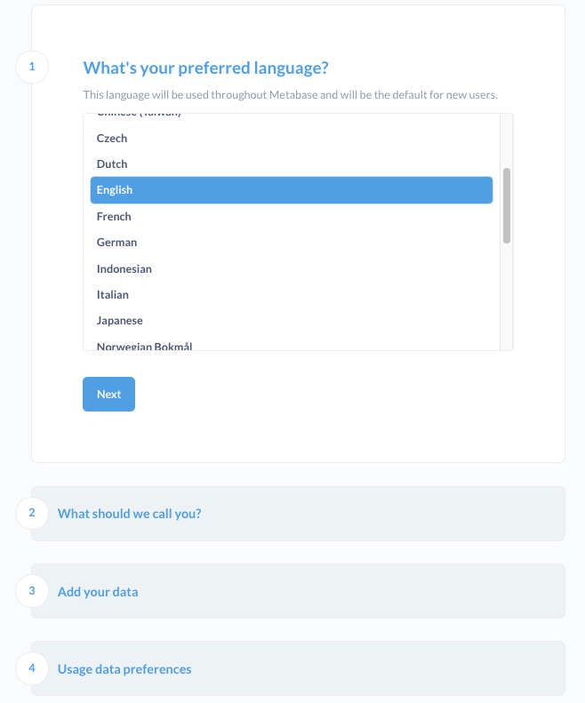
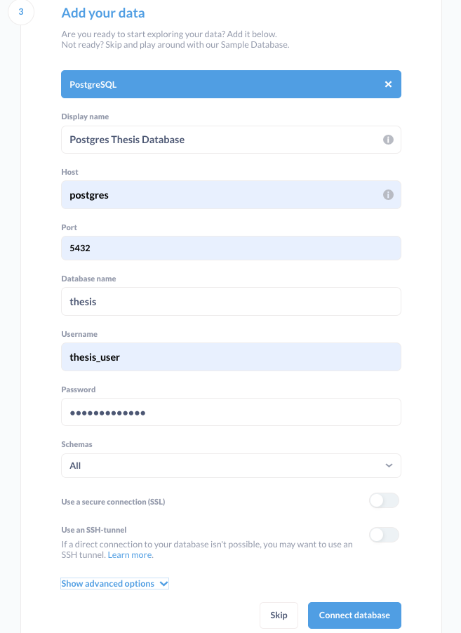
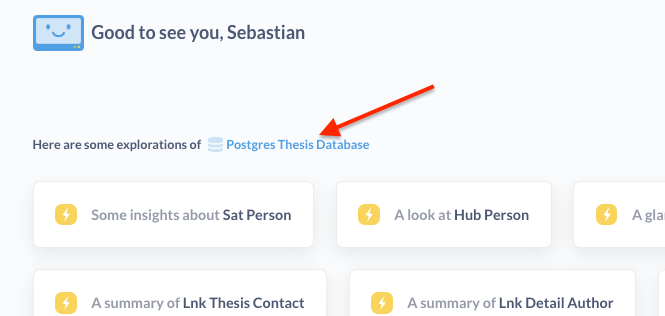

# Setup the BI Mini-Project P02

This manual describes all requirements and steps to prepare and execute this BI Mini-Project.

## Requirements/ Prerequisites
Following requirements are needed for the project:
* Unix System Environment (Linux / macOS)
* [Python3.10 or higher installed](https://www.python.org/)
* Pip installed
* Docker and Docker Compose installed (for PostgreSQL and Metabase installation)

## Preparing the Data Set
The data set must be downloaded from https://cloudstorage.elearning.uni-oldenburg.de/s/XXXXXXXXXXXX. After that the data 
set can be unzipped and the inner folder "data-uol-thesis-topics" must be placed in the **root folder** of this project. 
This is the folder directly containing the daily thesis exports.

`Note: The files (names) and structure of the data set must not change.`

While reviewing the data set cleaning or removal of wrong data/ duplicated data may be necessary.
In the thesis data set are 3 duplicated folders (20210719_****). They seem to have the same content and are the oldest
exports, maybe they were used for test purposes of the export. 
Removing two of the three duplicated folders:\
`rm -r data-uol-thesis-topics/20210719_2cb1/`\
`rm -r data-uol-thesis-topics/20210719_4196/`

Another issue in the dataset is missing files in the export from 2022-09-08. In the folder `data-uol-thesis-topics/20220908_2b64/` 
several files (like db-topics.csv) are missing. Therefore, we must the export from that day:\
`rm -r data-uol-thesis-topics/20220908_2b64/`

Note that this removed folder is later on considered in the ETL-Process when calculating removal dates of thesis.

## Installing PostgreSQL and Metabase
The PostgreSQL Database is required for the import of the thesis data and for the Metabase application. Metabase is 
needed for data visualisation and creation of dashboards. 
As the infrastructure is automated by Docker and Docker Compose, we just need to run the file _docker-compose.yml_ 
to install PostgreSQL and Metabase:\
`cd infrastructure`\
`docker-compose up`

The creation of the databases "thesis" and "metabase" with tables, users etc. is fully automated as the SQL-script 
(database/create.sql) is copied into "docker-entrypoint-initdb.d" and executed automatically.

`Note: For further steps it is assumed that the Docker containers are running.`

## Creating Python Environment
For development a virtual Python environment is recommended to track and install the requirements. This step is only 
required once when no virtual environment is present.

Move to the etl folder:\
`cd etl`

Create the virtual environment:\
`python3 -m venv venv`

Activate (use) the required virtual environment:\
`source ./venv/bin/activate`

Download and installation of the Python Requirements:\
`pip install -r requirements.txt`

## Execute the ETL process
The ETL process is fully automated by a Python Script, that also loads the data into the PostgreSQL database "thesis".

Start the Python script for extract and transform steps (in virtual environment):\
`python3 consolidate.py`

## Configuring and using Metabase
The installation and basic configuration is already done by Docker Compose.

Now we need to create a Metabase user and the thesis database connection by opening the Metabase UI. Metabase is 
accessible by opening the Endpoint given by Docker/ Docker Console, it should be: http://0.0.0.0:3000/

First step is to run the initial configuration with the wizard, after clicking "Let's Go" on the welcome screen:

Choose language (1) and insert contact data (2). After that we connect our thesis database to Metabase (3) with the 
_thesis_user_ (see database/create.sql):

The wizard step (4) for usage data preferences is optional and can be disabled. After clicking "Finish" we can directly
go to Metabase by "Take me to Metabase".

Now Metabase is ready to use. For instance, we can directly use automatic explorations from the Home Screen of Metabase:

With this, the setup of the project and infrastructure is complete.